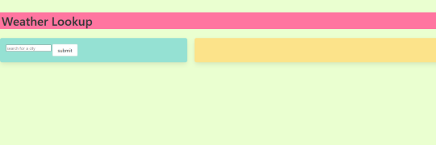
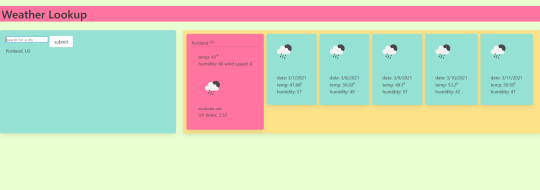

# Weather Forecast App
A simple app for retrieving weather forecasts for a given city from a weather data API.

## Usage:
* When the user inputs a city by name, the current weather conditions are retrieved and displayed, and then a forecast of the next five days is also retrieved and displayed.
* For convenience, the recently searched cities are saved in local storage and displayed in a list.

## Screenshots:

## Deployed link:
https://bnemeton.github.io/weatherapp/ 
